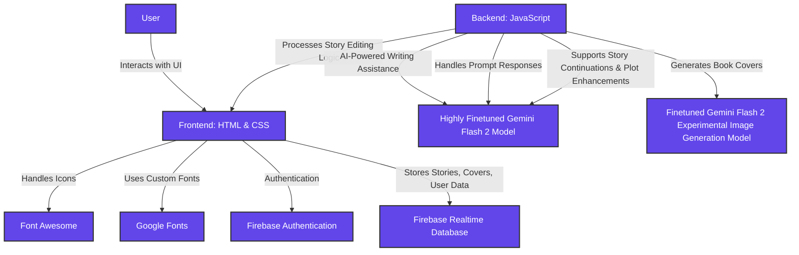

# **Authorly.ai**

**Unleash Your Imagination — AI-powered storytelling for the next generation of writers.**

**Authorly.ai** is a groundbreaking **AI-driven creative writing platform** that helps users **craft, customize, and share immersive stories** with ease. From **plot generation and character development** to **custom book covers and book-style formatting**, everything is powered by **intelligent tools** — giving you full creative freedom. Whether you're starting fresh or picking up mid-plot, Authorly.ai is your co-author every step of the way.

## 🚀 **Demo**

[Live Demo >](https://authorly-ai.web.app/)

> **Note:** Sensitive credentials and API keys have been omitted from the codebase.

---

## 🎯 **Inspiration**

Everyone has a story inside them — a spark of imagination waiting to be explored. But bringing that story to life often takes time, energy, and a little help along the way. 

**What if AI could be your creative companion — guiding your ideas, expanding your plot, and even designing your book cover — all in just a few clicks?** What if storytelling felt less like a task and more like a joyful, intuitive flow?

**Authorly.ai** was born from the belief that creativity should be effortless and fun. By blending **powerful AI tools** with a **beautifully designed writing space**, we empower storytellers to **craft compelling narratives**, explore limitless directions, and **share their stories with a global community** — all while keeping full control over their creative journey.

This is storytelling reimagined — collaborative, accessible, and inspired.

---

## ✨ **Key Features**  

### **AI-Charged Storytelling**  

> **Create captivating stories using powerful AI. From generating titles and descriptions to writing full plots and enhancing them, AI helps you every step of the way.**

### **Custom Book Covers**  

> **Design stunning, professional-grade book covers for your story with the help of advanced AI — perfect for bringing your story’s vibe to life.**

### **Interactive Story Creation**  

> **Easily continue your plot, introduce new characters, or twist your story in new directions — all with just a few clicks, thanks to intuitive AI tools.**

### **Organized Book-like Pages**  

> **Turn your stories into elegant, book-style layouts. Perfectly formatted pages give your writing a polished and immersive feel.**

### **Story Sharing & Discovery**  

> **Share your creations with the Authorly.ai community and explore a world of stories from writers across the globe. Want to share privately or with friends? Just send them a direct link — it's that simple.**

### **Full Creative Control**  

> **Edit your stories whenever inspiration strikes or delete them when it’s time for a fresh start — your content, your call.**

---

## 🛠️ **Technology Stack**

- **Frontend:** HTML + CSS  

- **Backend:** JavaScript  

- **AI Model:** Highly Finetuned Gemini Flash 2 (for writing assistance, plot continuation, etc.)  

- **Book Cover Generation:** Finetuned Gemini Flash 2 Experimental Image Generation Model  

- **Icons:** Font Awesome  

- **Fonts:** Google Fonts  

- **Authentication:** Firebase Authentication 
 
- **Database:** Firebase Realtime Database  

---

## 📋 **Impact & Benefits**

- **Create Stories Faster & Smarter:** With AI assistance at every stage, you can go from a blank page to a full story in minutes — without creative blocks.

- **Professional-Quality Book Covers:** Instantly generate stunning, AI-designed book covers that make your stories pop and feel publish-ready.

- **Sharable & Discoverable:** Share your work directly with friends using a link, or publish it to the Authorly.ai community to gain readers and inspiration.

- **Collaborate with AI, Not Against It:** Whether you need help continuing a plot, building a new character, or refining your narrative, the AI works with you, not over you.

- **Creative Freedom, Total Control:** Edit, update, or delete your stories anytime. You’re always in charge of your content and how it’s seen.

- **A Beautiful Writing Experience:** Authorly.ai transforms your stories into elegant, book-style pages — giving every story a polished, immersive feel.

---

## 🚀 Getting Started

### Requirements:
- A modern web browser with JavaScript enabled.
- Stable internet connection for loading media and syncing data.

### Steps:
1. Open Authorly.ai in your browser.  
2. Sign up to create your free account.  
3. Start a new story, generate ideas with AI, and bring your imagination to life — one click at a time!

---

## 🤝 **Contributing**  

Contributions are always welcome! Please follow these steps:

1. Fork the repository.  
2. Create a new branch (`git checkout -b feature/your-feature`).  
3. Commit your changes (`git commit -m 'Add your message'`).  
4. Push to the branch (`git push origin feature/your-feature`).  

---

Built with ❤️ to make storytelling more effortless, empowering, and inspiring — powered by AI, crafted for creators.
